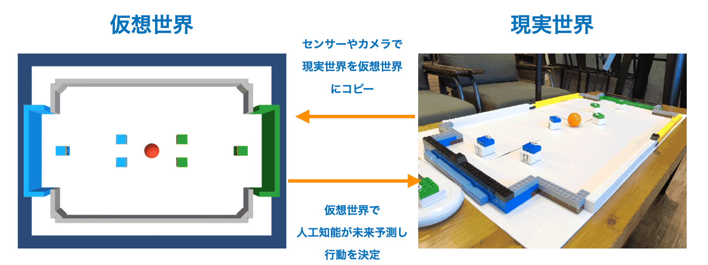
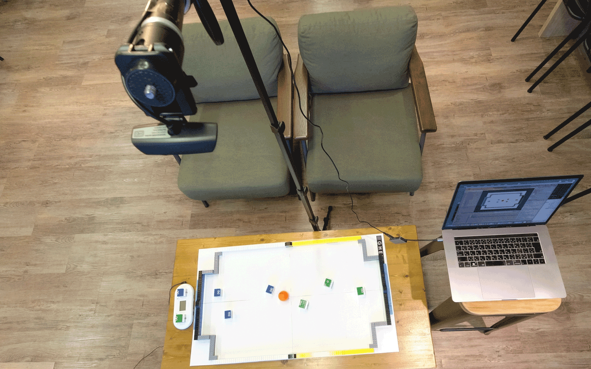

# **AI ロボットサッカー**

 

## **1. AI ロボットサッカー の概要**

「**AI ロボットサッカー**」は、キューブ型ロボット「**toio**」で 人工知能による 3 vs 3 のサッカー対戦を行うアプリケーションです。

## **2. コア技術**

「AI ロボットサッカー」は、以下の 4 つの技術を活用しています。

- **toio** : キューブ型ロボット
- **Unity ML-Agents** : 人工知能。
- **OpenCV** : ボール位置の検出。
- **Mirror** : 2 台の PC で対戦したい時に利用。

 

 

## **3. 必要機材**

「AI ロボットサッカー」の実行に必要な機材は、次のとおりです。

- **PC (Mac)**
- **toio コアキューブ 6 台 / 充電器 / 開発用プレイマット**
- **Web カメラ / 固定する三脚**
- **レゴブロック**
- **ゴルフボール (オレンジ)**

 

 

## **4. AI ロボットサッカー のインストール**

- [AI ロボットサッカー のインストール](docs/Install.md)

 

## **5. AI ロボットサッカー の実行**

- [シミュレーションモードでの実行](docs/RunSimulation.md)
- [実機モードでの実行](docs/RunRobot.md)

 

## **6. AI ロボットサッカー の学習**

- [AI ロボットサッカー の学習](docs/Training.md)
- [サンプル実装の観察・行動・報酬](docs/Sample.md)
- [ToioManager の API リファレンス](docs/ToioManager.md)

# **License**

[MIT](LICENSE.md)
