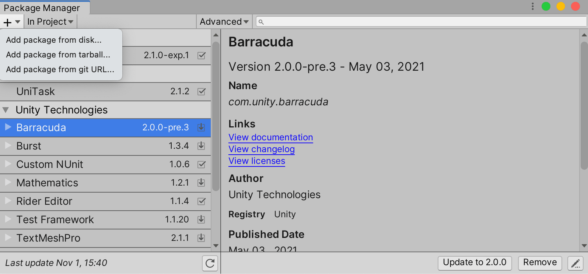
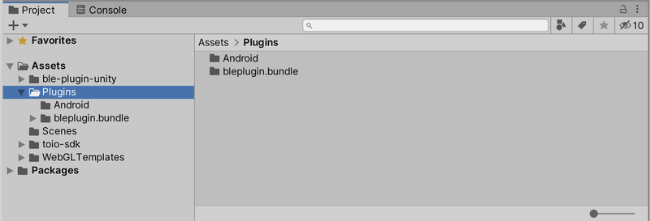
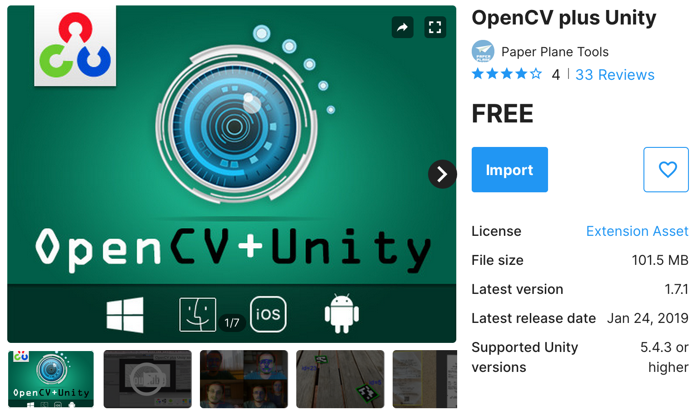
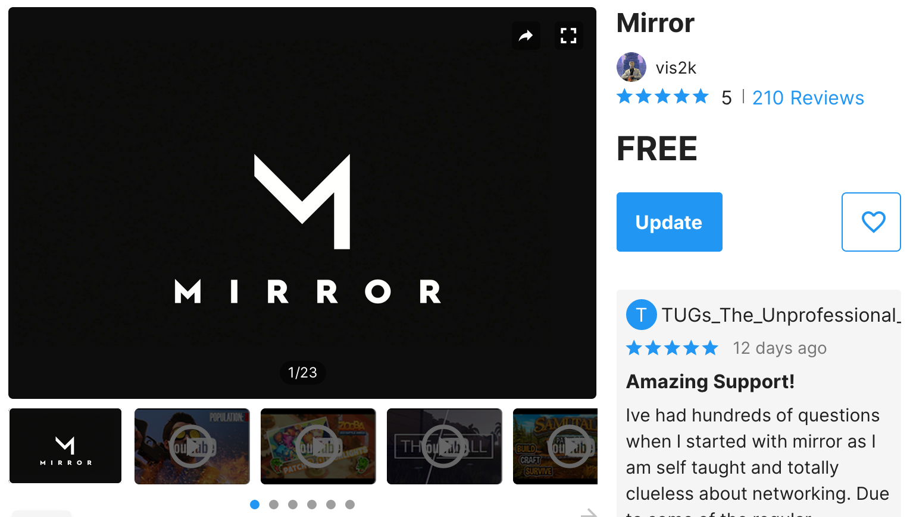
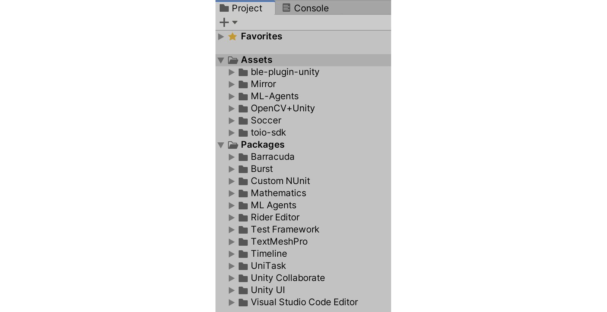
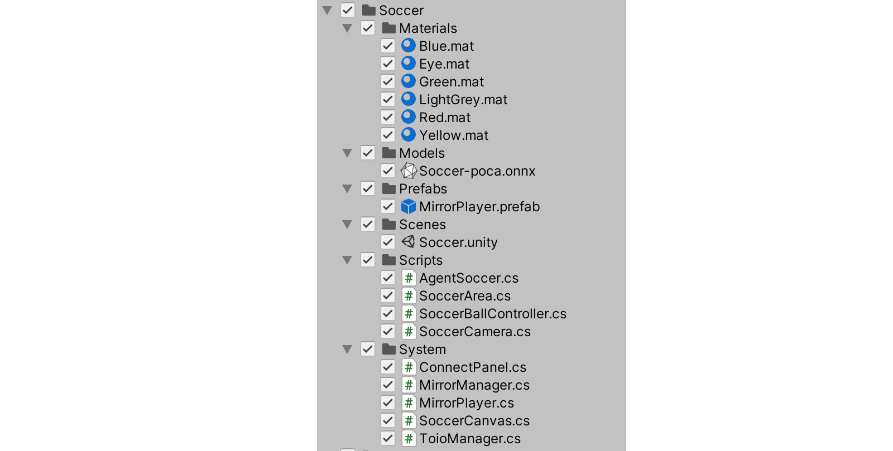
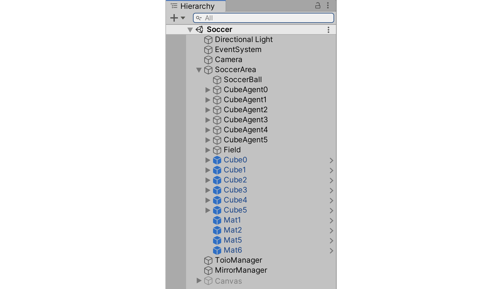

# **4-1. AI ロボットサッカー のインストール**

<br>

## **4-1-1. Unity と Unity パッケージのバージョン**

「AI ロボットサッカー」 で使われている Unity のバージョンは、次のとおりです。

- **Unity 2020.3.25f1**

<br>

Unity パッケージのバージョンは、次のとおりです。

<br>

- **ai-robot-soccer v1.0**
- **Unity ML-Agents Relase 18**
- **UniTask 2.0**
- **toio SDK for Unity v1.4.0**
- **OpenCV plus Unity v1.7.1**
- **Mirror v45.2.0**

<br>

## **4-1-2. Unity 2020.3.25f1 のインストール**

「**Unity**」のインストール手順は、次のとおりです。

<br>

(1) 「**Unity Hub**」 をインストール。

[https://unity3d.com/jp/get-unity/download](https://unity3d.com/jp/get-unity/download)

(2) 「**Unity 2020.3.25f1**」をインストール。

<br>

## **4-1-3. AI ロボットサッカー v1.0 のインストール**

「**AI ロボットサッカー**」のインストール手順は、次のとおりです。

<br>

(1) 「AI ロボットサッカー」のリポジトリから「ai-robot-soccer.unitypackage」 をダウンロード。

(2) Unity のメニュー「Assets → Import Package → Custom Package」 で「ai-robot-soccer.unitypackage」 を選択。

<br>

Assets に 「Soccer」 フォルダが追加されます。

<br>

## **4-1-4. Unity ML-Agents Relase 18 のインストール**

「[**Unity ML-Agents**](https://github.com/Unity-Technologies/ml-agents)」のインストール手順は、次のとおりです。

<br>

(1) 以下のサイトから「Source code(zip)」をダウンロードして解凍。
ml-agents-release_18 フォルダができます。

[https://github.com/Unity-Technologies/ml-agents/releases/tag/release_18](https://github.com/Unity-Technologies/ml-agents/releases/tag/release_18)

(2) Unity のメニュー「Window → Package Manager」で Package Manager を開き、「＋ → Add package from disk」 で以下の JSON を選択。

```
ml-agents-release_18/com.unity.ml-agents/package.json
```

<br>

Packages に 「ML Agents」 フォルダが追加されます。

<br>

## **4-1-5. UniTask 2.0 のインストール**

「[**UniTask**](https://github.com/Cysharp/UniTask)」のインストール手順は、次のとおりです。

<br>

(1) Unity のメニュー「Window → Package Manager」で Package Manager を開き、「＋ → Add package from git URL」 で、以下の URL を入力。

```
https://github.com/Cysharp/UniTask.git?path=src/UniTask/Assets/Plugins/UniTask
```

<br>



<br>

## **4-1-6. toio SDK for Unity v1.4.0 のインストール**

「[**toio SDK for Unity**](https://github.com/morikatron/toio-sdk-for-unity/)」のインストール手順は、次のとおりです。

<br>

(1) 以下のサイトから「toio-sdk-for-unity.unitypackage」 をダウンロード。

[https://github.com/morikatron/toio-sdk-for-unity/releases/tag/v1.4.0](https://github.com/morikatron/toio-sdk-for-unity/releases/tag/v1.4.0)

(2) Unity のメニュー「Assets → Import Package → Custom Package」 で「toio-sdk-for-unity.unitypackage」 を選択。

toio-sdk/Samples と toio-sdk/Tutorials と Plugins と WebGL Templates は省略した方がディスク容量削減できます。

<br>

Assets に 「toio-sdk」 フォルダが追加されます。

<br>

**◎ BLE プラグイン**

Mac から toio を直接操作するには、「BLE プラグイン」が必要になります。

(1) 「[toio/ble-plugin-unity/Releases](https://github.com/toio/ble-plugin-unity/releases)」から「bleplugin_XX.bundle.zip」をダウンロードして解凍。

<br>

- **macOS 10.x** : bleplugin_10.bundle.zip
- **macOS 11.x/12.x** : bleplugin_11.bundle.zip
- **その他** : [こちら](https://github.com/morikatron/toio-sdk-for-unity/blob/main/docs/usage_macble.md#%E8%87%AA%E5%88%86%E3%81%AEpc%E3%81%A7bundle%E3%83%95%E3%82%A1%E3%82%A4%E3%83%AB%E3%82%92%E3%83%93%E3%83%AB%E3%83%89%E3%81%99%E3%82%8B%E6%96%B9%E6%B3%95)を参照

<br>

(2) 「bleplugin_XX.bundle」を Project ウィンドウの「Assets → ble-plugin-unity → Plugins」にドラッグ&ドロップ。



<br>

## **4-1-7. OpenCV plus Unity v1.7.1 のインストール**

「[**OpenCV plus Unity**](https://assetstore.unity.com/packages/tools/integration/opencv-plus-unity-85928?locale=ja-JP)」のインストール手順は、次のとおりです。

<br>

(1) Asset Store から 「OpenCV plus Unity」 をインポート。



OpenCV+Unity/Demo と OpenCV+Unity/Document は省略した方がディスク容量削減できます。

<br>

Assets に 「OpenCV + Unity」 フォルダが追加されます。

<br>

## **4-1-8. Mirror v45.2.0 のインストール**

「[**Mirror**](https://assetstore.unity.com/packages/tools/network/mirror-129321)」のインストール手順は、次のとおりです。

<br>

(1) Asset Store から 「OpenCV plus Unity」 をインポート。



※ Mirror/Examples と ScriptTemplate は省略しても省略した方がディスク容量削減できます。

<br>

Assets に 「Mirror」 フォルダが追加されます。

<br>

## **4-1-9. Project ウィンドウのフォルダ構成**

インストール後の、Project ウィンドウのフォルダ構成は、次のとおりです。

<br>



<br>

Soccer フォルダ内のフォルダ構成は、次のとおりです。

<br>



<br>

- **Materials** - マテリアル
- **Models** - 推論モデル
- **Prefabs** - プレハブ
- **Scenes** - シーン
- **Scripts** - カスタマイズ可能なスクリプト
  - **AgentSoccer.cs** - サッカープレイヤーのスクリプト
  - **SoccerArea.cs** - サッカーエリアのスクリプト
  - **SoccerBallController.cs** - サッカーボールとゴールの衝突を SoccerArea に通知するスクリプト
  - **SoccerCamera.cs** - Web カメラによるボール位置計算のスクリプト
- **System** - カスタマイズ禁止のスクリプト
  - **SoccerCanvas.cs** - モード UI のスクリプト
  - **ConnectPanel.cs** - モード UI のパネルのスクリプト
  - **MirrorManager.cs** - Mirror 管理のスクリプト
  - **MirrorPlayer.cs** - Mirror プレイヤーのスクリプト
  - **ToioManager.cs** - toio 管理のスクリプト

<br>

## **4-1-10. Hierarchy ウィンドウのツリー構成**

<br>



<br>

- **Directional Light** - ライト
- **EventSystem** - イベントシステム
- **Camera** - カメラ
- **SoccerArea** - サッカーエリアのオブジェクト
  - **SoccerBall** - サッカーボールのオブジェクト
  - **CubeAgent0〜5** - 強化学習に利用するキューブエージェントのオブジェクト
  - **Cube0〜5** - toio の操作に利用するキューブのオブジェクト
  - **Mat** - toio のプレイマット
  - **Field** - サッカーフィールドのオブジェクト
- **ToioManager** - toio 管理のオブジェクト
- **MirrorManager** -Mirror 管理のオブジェクト
- **Canvas** - モード UI

<br>

## **4-1-11. トラブルシューティング**

<br>

**(1)「error CS0227: Unsafe code may only appear if compiling with /unsafe.」が表示される**

Unity のメニュー「Edit → Project Settings」の「Player」から「Allow 'unsafe' Code」にチェックを入れてください。

**(2)「UnityException: Tag: t4u_Magnet is not defined.」が表示される**

エラー発生箇所(CubeSimulator.cs)の isSimulateMagneticSensor を false にしてください。
