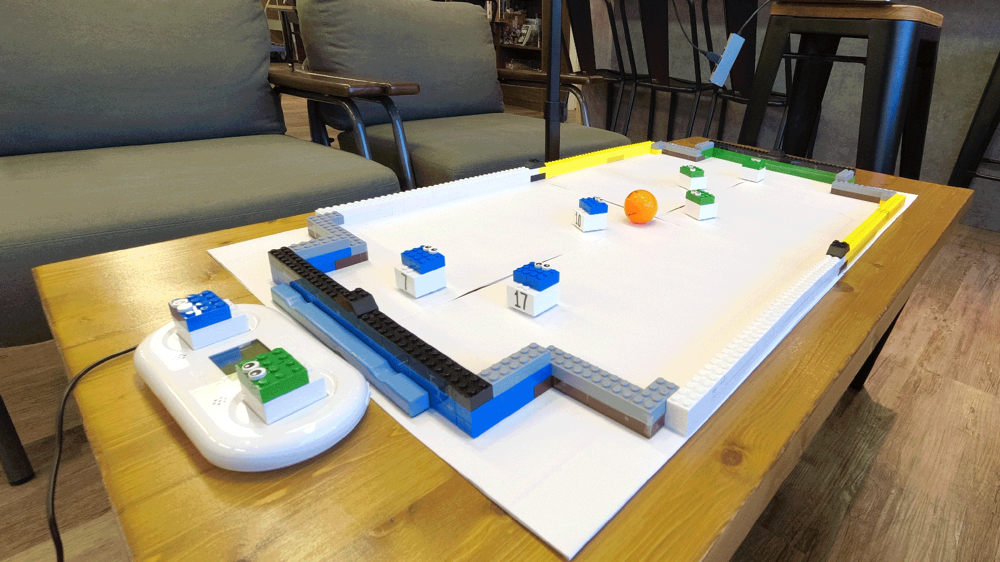
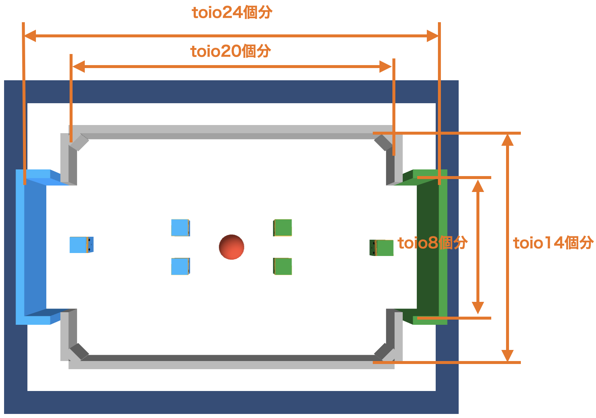
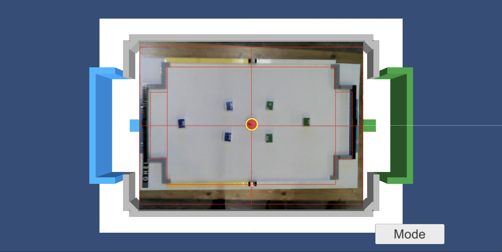
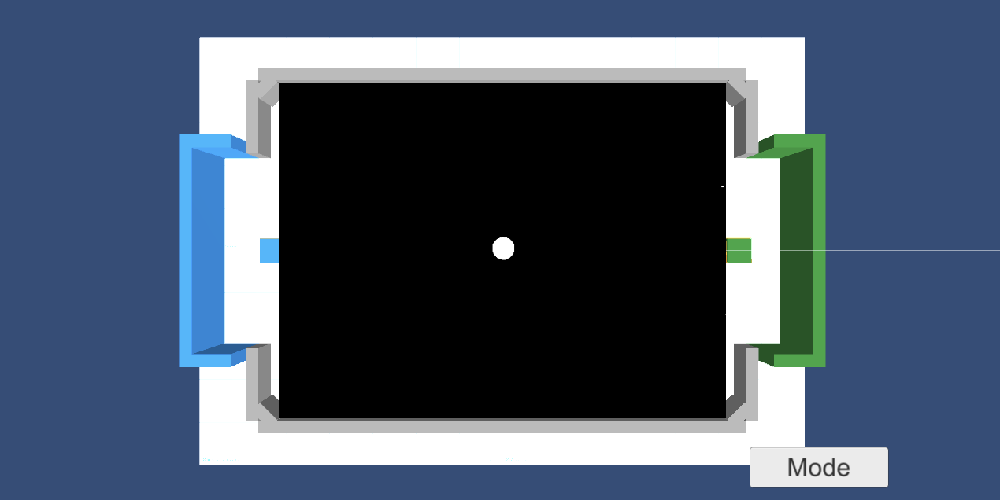
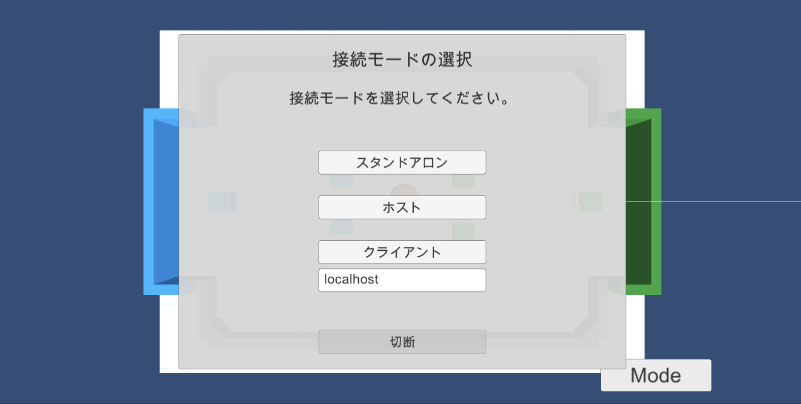

# **5-2. 実機モードでの実行**

「実機モード」での実行の手順は、次のとおりです。

 

## **5-2-1. フィールドの準備**

フィールドの準備の手順は、次のとおりです。

(1) 「toio 開発用プレイマット」（1,2,5,6）と「レゴブロック」で、以下のサイズのフィールドを作成。

toio1 個分は、レゴブロックの長辺のサイズになります。

(2) フィールドの角に三角ブロックを配置。

 

## **5-2-2. Web カメラ位置の調整**

(1) Hierarchy ウィンドウで 「ToioManager」 を選択し、Inspector ウィンドウの「ToioManager」で、「Connect Type」に「Real」を指定し、Simulation のチェックをはずして、Play ボタンで実行。

(3) Mode ボタンで「Web カメラモード」を選択し、Web カメラ位置を調整（枠線とレゴブロックの内側を揃える）。

Web カメラの映像が映らない場合は、Hierarchy ウィンドウの「SoccerCamera」 の 「Camera Id」を 0 から 1 または 2 などに変更してみてください。

(4) Mode ボタンで「HSV モード」を選択し、ボール認識を確認。

 

実機モードの右下の Mode ボタンでは、以下を切り替えることができます。

1. **通常モード** : シミュレータのみを表示。
1. **Web カメラモード** : Web カメラの RGB 画像を表示 (Web カメラ位置調整)。
1. **HSV モード** : WEB カメラの HSV 画像を表示 (ボール認識の確認)。
1. **接続 モード** : 2 台の PC を接続して対戦が可能。

 

## **5-2-3. スタンドアロンモードでの実行**

「スタンドアロンモード」は、PC1 台で toio 6 台を操作するモードです。

(1) センターラインより左に青 toio を 3 台、右に緑 toio を 3 台配置。 
センターラインより左か右かで青か緑かを判定します。

(2) Mode ボタンで接続モードを選択し、スタンドアロンボタンを押す。

(3) ボールをフィールドの中央に配置。 
試合がはじまります。

 

## **5-2-4. クライアント・サーバーモードのペアリング**

「クライアント・サーバーモード」は、2 台の PC で 3 台ずつ操作するモードです。Wi-Fi 経由で接続します。

(1) 2 台の PC を同じ Wi-Fi に接続。

(2) 青 toio の電源を ON にし、緑 toio の電源を OFF にする。

(3) 1 台目の PC で、Mode ボタンで接続モードを選択し、サーバーボタンを押す。
青 toio3 台の接続音が鳴るまで待ちます。 

(4) 緑 toio の電源を ON にする。

(5) 2 台目の PC で、Mode ボタンで接続モードを選択し、IP アドレスを設定し、クライアントボタンを押す。 
緑 toio3 台の接続音が鳴るまで待ちます。 

(6) ボールをフィールドの中央に配置。 
試合がはじまります。

 
