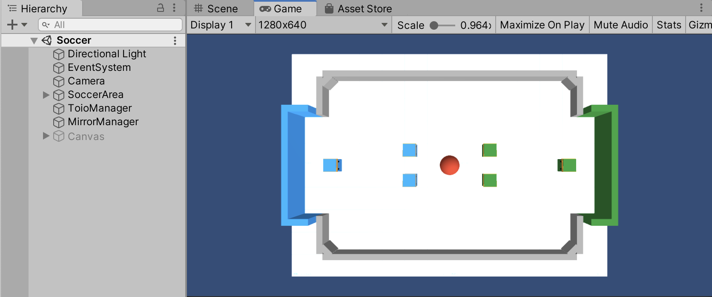
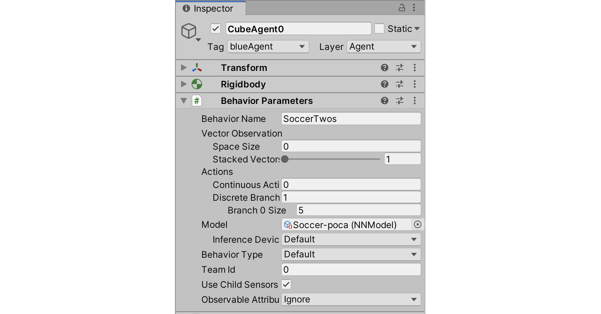
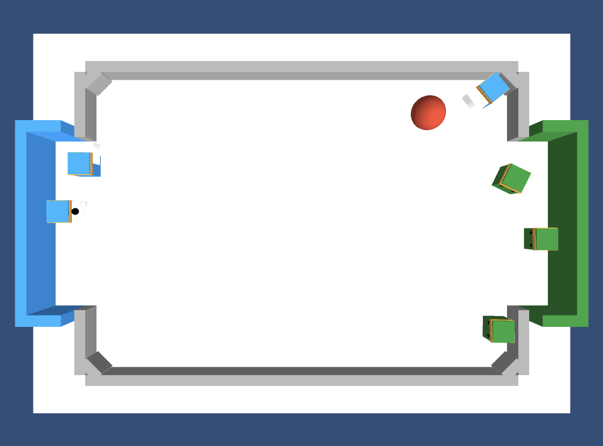

# **5-1. シミュレーションモードでの実行**

「シミュレーションモード」での実行の手順は、次のとおりです。

 

## **5-1-1. シミュレーションモードでの実行**

動作確認のため、学習済みモデルを使って、「シミュレーションモード」で実行します。

 

(1) Unity でシーン「Assets/Soccer/Scenes/Soccer」 を開く。

 

 

(2) Hierarchy ウィンドウで 「CubeAgent0〜5」 を選択し、Inspector ウィンドウの「Behavior Parameters → Model」で「Soccer-poca」が設定されていることを確認。

サッカープレイヤーごとに推論モデルを設定することができます。

 

 

(3) Hierarchy ウィンドウで 「ToioManager」 を選択し、Inspector ウィンドウの「ToioManager」で、「Connect Type」に「Simulator」を指定し、Simulation をチェック。

 

 

「**Connect Type**」は toio 実機で実行するかどうかを指定します。

- **Simulator** : シミュレータで実行。
- **Real** : toio 実機で実行。

 

「**Simulator**」の設定の違いは次のとおりです。

- **チェックあり**
  - 画面右下の Mode ボタンを非表示。
  - Web カメラによるボール位置計算が無効。
  - 2 台の PC での対戦が不可。
- **チェックなし**
  - 画面右下の Mode ボタンを表示。
  - Web カメラによるボール位置計算が有効。
  - 2 台の PC での対戦が可能。

 

(4) Unity の Play ボタンを押す。

Unity エディタ上で実行されます。

Cube0〜5 (白い toio キューブ) は実機をシミュレートしているため 60FPS で動きますが、CubeAgent0〜5 (青・緑の ML-Agents キューブ) は実機の位置を 10FPS で若干遅れて反映されます。

  

## **5-1-2. トラブルシューティング**

 

**(1)「開発元を検証できないため開けません」が表示される**

Mac では「システム環境設定 → セキュリティとプライバシー」で「このまま許可」を選択して、再度実行してください。

  
