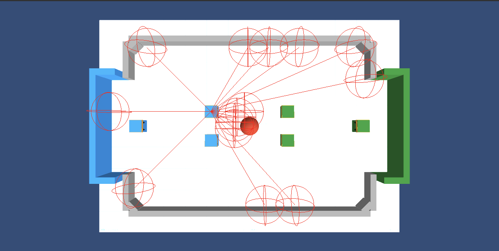

# **6-2. サンプルの観察・行動・報酬**

「AI ロボットサッカー」 のサンプル実装の観察・行動・報酬について説明します。

 

## **6-2-1. サンプルの観察**

 

サンプルの観察は、次のとおりです。

- 「CubeAgent0〜5」 の 「Ray Perception Sensor 3D」 : 前方に 11 本のレイ
- 「CubeAgent0〜5 → BlueReverseRays/GreenReverseRays」の「Ray Perception Sensor 3D」 : 後方に 3 本のレイ

レイは、距離と衝突したオブジェクト種別を検出します。

 

## **6-2-2. サンプルの報酬**

 

サンプルの報酬は、次のとおりです。「SoccerArea.cs」 で実装しています。

 

- **ボールが相手のゴールに入った時** : チームに「+1-(現ステップ数/最大ステップ数)」点
- **ボールが自分のゴールに入った時** :チームに「-1」点
- **ボールが相手のゴールに近づいた時**: チームに「+移動距離/0.5」点
- **ボールが自分のゴール側に近づいた時**: チームに「-移動距離/0.5」点

 

※ 移動距離の単位は Unit です。

 

## **6-2-3. 行動**

 

サンプルの行動は、次のとおりです。「AgentSoccer.cs」 で実装しています。

 

- **0** : なし
- **1** : 前進
- **2** : 後進
- **3** : 右回転
- **4** : 左回転

 
