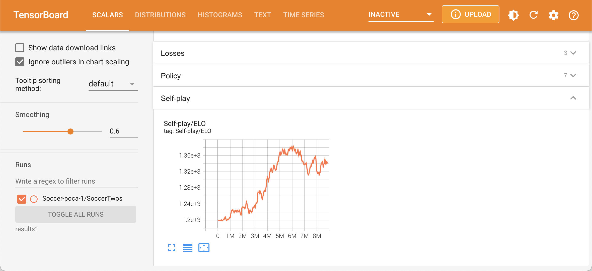

# **6-1. AI ロボットサッカー の学習**

「AI ロボットサッカー」 の学習は、次のとおりです。

<br>

## **6-1-1. Python パッケージのインストール**

(1) 「Python 3.7」の開発環境をインストール。

<br>

- [Python 入門 (1) - Mac での開発環境の準備](https://note.com/npaka/n/n096f810f36a6)
- [Python 入門 (2) - Windows での開発環境の準備](https://note.com/npaka/n/n94fb223fbf29)

<br>

(2) Python の仮想環境で、ml-agents-release_18 フォルダに移動し、以下のコマンドを実行。

```
$ pip install --upgrade pip
$ pip install -e ./ml-agents-envs
$ pip install -e ./ml-agents
```

<br>

「ML-Agents」の学習と推論については、以下が参考にしてください。

- [Unity ML-Agents Release 18 のチュートリアル](https://note.com/npaka/n/ndd679aa343ea)

<br>

## **6-1-2. 学習設定ファイル(YAML ファイル)の準備**

学習設定ファイル(YAML ファイル)の準備の手順は、次のとおりです。

(1) AI ロボットサッカー の「config/ai-robot-soccer-poca.yaml」を ml-agents-release_18 フォルダにコピー。

<br>

## **6-1-3. 学習環境(Unity の実行ファイル)の準備**

学習環境(Unity の実行ファイル)の準備の手順は、次のとおりです。

<br>

(1) Unity でシーン「Assets/Soccer/Scenes/Soccer」 を開く。

(2) Hierarchy ウィンドウで ToioManager を選択し、Inspector ウィンドウの「ToioManager → Simulation」にチェックを付ける。

(3) Unity のメニュー「Edit → Project Settings」の「Player」で以下を設定。

<br>

- **Resolution and Presentation →Fullscreen Mode** : Windowed
- **Other Settings → Camera Usage Description** : カメラを利用します。

<br>

(4) Unity の メニュー「File → Build Settings」で Standalone アプリとしてビルド。

Soccer.exe(または app)が生成されます。

<br>

## **6-1-4. 学習の実行**

学習の実行の手順は、次のとおりです。

<br>

(1) ml-agents-release_18 フォルダで、以下の学習コマンドを実行。

```
$ mlagents-learn ./config/ai-robot-soccer-poca.yaml --env=Soccer --time-scale=1 --num-envs=8 --width=160 --height=80 --run-id=Soccer-poca-1
```

<br>

- **./config/ai-robot-soccer-poca.yaml** : 学習設定ファイル (YAML ファイル)
- **--env** : 学習環境(Unity の実行ファイル)
- **--time-scale=1** : toio で学習するには必須。
- **--num-envs** : 同時起動する学習環境数
- **--width** : 画面幅
- **--height** : 画面高さ
- **--run-id** : 実行 ID (実行毎に異なる ID を指定)

<br>

(2) TensorBoard で学習状況を確認。

```
$ tensorboard --logdir=results
```

<br>

サンプルではセルフプレイを行っているため、学習できているかどうかは「ELO」で判断します。
付属の学習済みモデルは、「MacBook Pro(M1 2020)」で、同時起動する学習環境数 8 で 24 時間学習させています。ステップ数は 9M ほどになりました。



(3) Control-C で学習完了。

「results/Soccer-poca-1」 に学習結果のモデル「Soccer-poca-1.onnx」が出力されます。
